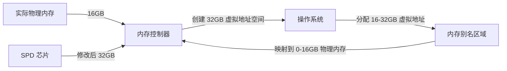

# 「Download More RAM」攻击：SPD 内存芯片漏洞如何瓦解 Windows VBS 防线

> **研究团队**：英国伯明翰大学（University of Birmingham）与杜伦大学（Durham University）  
> **CVE 编号**：CVE-2026-23670  
> **发布日期**：2026 年 8 月 19 日 | **技术解读**：FreeLamp 社区

## 攻击概览：当内存芯片成为攻击入口


> **研究团队**：英国伯明翰大学（University of Birmingham）与杜伦大学（Durham University）  
> **CVE 编号**：CVE-2026-23670  
> **发布日期**：2026 年 8 月 19 日 | **技术解读**：FreeLamp 社区

---

## 一、攻击概览：当内存芯片成为攻击入口

2026 年 8 月，英国伯明翰大学安全系教授 **Tom Chothia** 与杜伦大学研究团队联合发布了一项颠覆性研究：**「Download More RAM」攻击**。该攻击利用 PC 内存模组上的 **SPD（Serial Presence Detect）芯片**漏洞，能够完全绕过微软 Windows 11 构建的 **VBS（Virtualization-Based Security，基于虚拟化的安全）** 和 **HVCI（Hypervisor-Protected Code Integrity，超平台保护代码完整性）** 防线。

### 影响范围
- **全球数亿台 Windows 11 PC** 受威胁
- **无需用户持续交互**：仅需一次恶意软件执行即可建立持久攻击通道
- **可直接读取内核机密数据**、关闭防毒软件、关闭端点检测响应（EDR）系统

> **关键突破**：这是首个通过 **硬件内存芯片** 而非软件/固件漏洞直接绕过 VBS/HVCI 的攻击。

---

## 二、Windows VBS 与 HVCI：安全防线的基石

### 2.1 VBS/HVCI 的安全架构

VBS 和 HVCI 是 Windows 11 安全体系的**核心防御层**，其设计目标是：

1. **硬件虚拟化隔离**：利用 CPU 的虚拟化扩展（如 Intel VT-x / AMD-V）创建独立的、隔离的「安全核心」（Secure Core）
2. **内核保护**：保护系统密钥、防病毒进程、操作系统内核，即使攻击者取得 **Administrator 或 SYSTEM 权限**，也无法篡改安全核心内的数据
3. **代码完整性**：通过超级用户模式（Hypervisor）验证每个内核驱动和代码的签名，防止恶意代码注入

**传统攻击面**：此前几乎所有绕过 VBS 的攻击都针对：
- 虚拟化层软件漏洞（如 Hyper-V 漏洞）
- 内核驱动签名欺骗
- 固件/BIOS 层面的漏洞

**「Download More RAM」的突破**：通过 **内存硬件层** 的 SPD 芯片，直接欺骗系统对内存容量的认知，建立未授权的内核访问通道。

---

## 三、攻击原理：内存别名（Memory Alias）机制

### 3.1 SPD 芯片的作用

内存模组上的 **SPD（Serial Presence Detect）芯片** 是一个小型 EEPROM 存储器，负责向主板报告：

- **内存容量**（总容量）
- **时序参数**（延迟、频率）
- **电气特性**（电压、刷新率）
- **厂商信息**、序列号等

系统启动时，BIOS/UEFI 通过 I2C 总线读取 SPD 数据，配置内存控制器以匹配报告参数。

### 3.2 攻击者的「容量欺骗」

**攻击链核心**：
1. **修改 SPD 数据**：攻击者通过系统总线（I2C/SMBus）读取并修改 SPD 芯片内容
2. **报告双倍容量**：将实际 16GB 内存的 SPD 数据修改为 **32GB**（或其他翻倍数值）
3. **系统误判**：重启后，操作系统认为安装了双倍内存，并据此计算虚拟地址空间



### 3.3 内存别名：绕过 VBS 的关键

**核心漏洞**：当系统认为有 32GB 内存时：
- 它会为 **16-32GB 的虚拟地址** 分配空间
- 但这些地址**并未真正映射到独立物理内存**
- 相反，这些「额外」地址被映射到 **0-16GB 的物理内存区域**，形成**内存别名（Memory Alias）**

**攻击利用**：
1. **建立双重映射**：相同的物理内存位置同时存在于：
   - **低地址段**（0-16GB）：正常映射
   - **高地址段**（16-32GB）：别名映射
2. **绕过权限检查**：VBS/HVCI 设计时假设地址空间是**一对一映射**，未考虑别名场景
3. **特权逃逸**：攻击者可通过别名地址访问安全核心受保护的区域，实现：
   - 直接读取内核机密数据（如加密密钥、密码哈希）
   - 关闭 EDR 系统
   - 禁用防病毒进程
   - 取得系统最高控制权

> **技术突破**：这是首个通过**内存容量欺骗**而非软件漏洞绕过的 VBS 攻击。

---

## 四、SPD 芯片的防护缺失

### 4.1 消费级内存的 SPD 写入保护现状

研究团队对市面主流 DDR4 和 DDR5 内存模组进行了广泛抽样测试，发现：

| SPD 芯片类型 | 写入保护机制 | 可修改性 |
|-------------|-------------|---------|
| **高端/游戏内存** | 无保护或软件保护（仅防误写） | ✅ 可反复修改 |
| **普通消费级内存** | 无保护 | ✅ 可修改 |
| **入门级内存（一次性写入）** | OTP（One-Time Programmable），内容固化 | ❌ 不可修改 |

**关键发现**：
- 大部分内存厂商**未在 SPD 芯片中启用写保护**
- 即使部分内存有保护，也多为**软件层面的防误写**，而非硬件级安全保护
- **缺乏标准规范**：JEDEC 内存标准未强制要求 SPD 芯片的完整性保护

### 4.2 攻击工具链：一键式自动化脚本

Tom Chothia 团队已开发出**自动化攻击脚本**，可在**无需用户交互**的情况下完成以下攻击链：

1. **检测目标系统**：识别目标主板的 I2C 总线访问权限
2. **读取 SPD 数据**：提取当前内存容量、时序等关键参数
3. **修改 SPD 芯片**：写入双倍容量数据
4. **触发系统重启**：系统启动时读取被篡改 SPD
5. **建立内存别名**：在操作系统内存管理器中创建虚拟地址别名
6. **权限提升**：通过别名访问 VBS 隔离区域
7. **持久化**：维持攻击通道，即使再次重启也不中断

> **自动化程度**：整个过程可在**单一步骤**内完成，无需进一步用户交互。

---

## 五、微软的应对措施与补丁分析

### 5.1 CVE-2026-23670

微软已将此漏洞登记为 **CVE-2026-23670**，并发布紧急安全更新。

**补丁内容**（根据官方公告）：
- 增强 VBS/HVCI 对**内存容量一致性**的校验
- 增加**SPD 数据完整性验证**
- 限制虚拟内存地址与物理内存的映射检查

### 5.2 缓解效果的局限性

微软明确指出，由于漏洞**根源在于内存硬件架构与操作系统交互逻辑**，补丁**仅能提供**部分缓解：

| 缓解措施 | 效果 | 局限性 |
|---------|------|-------|
| 增强内存容量校验 | 可防止明显的容量翻倍攻击 | 无法防御更精细的容量欺骗 |
| SPD 数据签名 | 可阻止未签名篡改 | 攻击者仍可修改 SPD 但保留签名校验（若硬件支持） |
| 虚拟化地址隔离加强 | 减少别名攻击面 | 无法完全消除地址空间映射漏洞 |

> **关键结论**：彻底消除此类攻击，需要**硬件厂商与微软更深入地优化内存控制器规范及底层架构保护**。

---

## 六、行业应对建议

### 6.1 对于企业/组织用户

1. **内存模组采购**：优先选择**支持 SPD 硬件写保护**的内存模组
2. **固件更新**：及时更新 BIOS/UEFI，启用**SPD 数据完整性验证**
3. **物理安全**：限制对服务器主板的物理访问，防止 I2C 总线被篡改
4. **监控策略**：部署**内存容量异常**检测机制，及时发现 SPD 篡改

### 6.2 对于消费者用户

1. **保持系统更新**：及时安装微软发布的安全补丁
2. **禁用可写 SPD**（如可能）：部分主板 BIOS 提供**SPD 写保护**选项
3. **避免未知来源恶意软件**：此类攻击需要初始恶意代码执行

### 6.3 对内存厂商的建议

1. **默认启用硬件写保护**：在 SPD 芯片上启用**OTP（一次性写入）模式**
2. **增加签名验证**：在 SPD 数据中加入**厂商数字签名**
3. **JEDEC 标准修订**：推动内存行业制定**SPD 安全规范**

---

## 七、深层思考：内存安全的未来方向

### 7.1「硬件即软件」的挑战

「Download More RAM」攻击揭示了**硬件安全与软件隔离层的错位**：
- VBS/HVCI 假设硬件是**可信且不可更改**的
- 但实际内存芯片的**可写性**使得同一物理地址可被映射到多个虚拟地址
- **硬件层漏洞**无法完全通过软件补丁彻底修复

> **启示**：未来的安全架构必须**同时考虑软件与硬件层**，建立「信任链」贯穿从芯片到应用的全局视图。

### 7.2 SPD 芯片的演进方向

| 当前状态 | 目标方向 |
|---------|---------|
| SPD 数据可写、无保护 | 硬件级写保护、不可篡改 |
| 无厂商签名验证 | 数字签名、完整性校验 |
| 依赖 BIOS 自行验证 | JEDEC 标准强制安全规范 |

### 7.3 行业协作的需求

彻底解决此类问题需要：
- **内存厂商**（如三星、海力士、美光）标准化 SPD 安全
- **主板厂商**（如华硕、技嘉、微星）在 BIOS 中集成验证
- **操作系统**（微软、苹果、Linux）加强虚拟化层内存映射检查
- **安全研究社区**持续监控内存子系统漏洞

---

## 八、技术影响与后续研究

### 8.1 相关攻击面扩展

除内存容量欺骗外，SPD 芯片还可被用于：
- **时序参数篡改**：导致系统稳定性问题，为其他攻击创造机会
- **电气特性伪造**：改变电压/刷新率，可能引发数据损坏
- **供应商信息伪造**：伪装为特殊硬件，规避软件限制

### 8.2 未来研究方向

1. **SPD 芯片硬件保护机制**
2. **内存控制器对 SPD 数据的可信验证**
3. **操作系统层面的内存容量一致性检查**
4. **虚拟化平台的地址空间隔离强化**

---

## 九、参考文献

1. **原始研究论文**：  
   - Tom Chothia et al., "Download More RAM: Bypassing VBS via SPD Memory Chip Exploitation", *University of Birmingham & Durham University Security Lab*, 2026.  
   - （技术报告链接待发布）

2. **CVE 详情**：
   - [CVE-2026-23670 - NVD 漏洞详情](https://nvd.nist.gov/vuln/detail/CVE-2026-23670)
   - [微软安全更新公告](https://msrc.microsoft.com/update/CVE-2026-23670)

3. **Windows VBS/HVCI 技术文档**：
   - [虚拟化基于的安全性 (VBS) - Microsoft Docs](https://docs.microsoft.com/windows/security/threat-protection/device-security/virtualization-based-security)
   - [HyperVisor Protected Code Integrity (HVCI) - Microsoft Docs](https://docs.microsoft.com/windows/security/threat-protection/device-security/code-integrity-protect-windows-virtualization-based-security)

4. **SPD 芯片技术规格**：
   - [JEDEC Standard - JESD21-C SPD Implementation](https://www.jedec.org/standards-documents/documents/jesd21-c)
   - [DDR4/DDR5 SPD Specification](https://jea.org/spd-specifications)

5. **历史案例**：
   - [Spectre/Meltdown (CVE-2017-5753/5754) - CPU 侧信道攻击](https://meltdownattack.com)
   - [Rowhammer - 内存位翻转攻击](https://github.com/google/rowhammer-defs)

6. **硬件安全最佳实践**：
   - [NIST Special Publication 800-192 - Trusted Platform Module (TPM)](https://csrc.nist.gov/publications/detail/sp/800-192/final)
   - [Intel Hardware Shield Security Features](https://www.intel.com/content/www/us/en/developer/articles/technical/intel-security-features.html)

---

> **作者简介**：本文基于英国伯明翰大学 Tom Chothia 团队与杜伦大学安全研究团队的原版研究报告编写，FreeLamp 社区提供技术解读与分析。  
> **版权声明**：本文基于公开资料解读，采用 CC BY-SA 4.0 协议。

## 附：攻击流程图示

```
┌─────────────────────────────────────────────────────────────────┐
│                    物理系统架构                                 │
├─────────────────────────────────────────────────────────────────┤
│                                                                 │
│  ┌──────────────┐    ┌──────────────┐    ┌──────────────┐     │
│  │  恶意软件     │    │ SPD 芯片     │    │ 内存控制器   │     │
│  │ (已执行)      │────>│ (可修改)     │────>│ (BIOS/UEFI)  │     │
│  └──────────────┘    └──────────────┘    └──────────────┘     │
│       │                  │                        │             │
│       │                  │                        ▼             │
│       │                  │              ┌─────────────────┐    │
│       │                  │              │  操作系统内存   │    │
│       │                  │              │  虚拟地址空间   │    │
│       │                  │              │                 │    │
│       │                  │              │  0-16GB         │◀───┼───┐
│       │                  │              │  16-32GB (别名) │    │   │
│       │                  │              │  32-48GB        │    │   │
│       │                  │              └─────────────────┘    │   │
│       │                  │                   │                 │   │
│       │                  │                   ▼                 │   │
│       │                  │              ┌─────────────────┐    │   │
│       │                  └──────────────│ VBS/HVCI 安全   │    │   │
│       │                                 │  隔离内存区域   │    │   │
│       │                                 │ (受保护内核)    │    │   │
│       └─────────────────────────────────┤                 │    │   │
│                                          └─────────────────┘    │   │
│                     通过别名访问敏感数据 ↑                     │
└─────────────────────────────────────────────────────────────────┘
```

**关键点**：
- 内存别名建立后，攻击者可**无需特殊权限**读取 VBS/HVCI 保护区域
- 传统权限模型失效，因为**地址空间映射**未被正确验证
- 补丁仅提供**部分缓解**，无法彻底解决硬件层面的信任问题

---

*本文通过技术架构分析揭示内存安全的新前沿，为行业推动 SPD 芯片标准化提供依据。*
