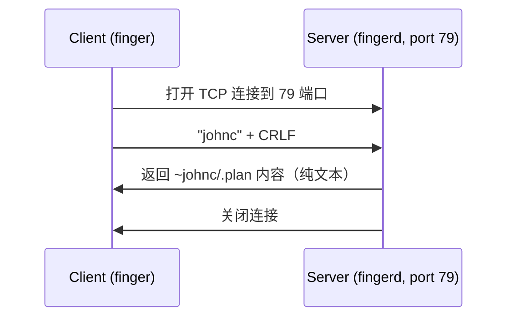

  - 技术考古
---

# Finger: 1971 年诞生的社交网络，它从未真正死亡

> **原文作者**: Andros Fenollosa  
> **编译解读**: FreeLamp 社区  
> **发布日期**: 2026 年 8 月 19 日  
> **关键词**: Finger 协议，极简社交网络，John Carmack, 技术考古，去中心化网络

## 引言：最早的社交网络竟然是 1971 年的？！

  - 技术考古
---

# Finger：1971 年诞生的社交网络，它从未真正死亡

> **原文作者**：Andros Fenollosa  
> **编译解读**：FreeLamp 社区  
> **发布日期**：2026 年 8 月 19 日  
> **关键词**：Finger 协议, 极简社交网络, John Carmack, 技术考古, 去中心化网络

---

## 一、引言：最早的社交网络竟然是 1971 年的？！

你可能会感到惊讶：**最早的社交网络竟然诞生于 1971 年**！

- **没有账号系统**
- **没有算法推荐**
- **没有中心服务器**
- **你的整个个人状态只存在于一个纯文本文件中，由你完全掌控**

《Doom》和《Quake》的联合创始人、传奇程序员 **John Carmack** 曾用它作为开发日志。有意思的是，**你的操作系统上可能已经预装了 Finger 客户端**！

但在半个世纪后，**Finger 协议依然健在**，说不定它还会迎来一波强势回归。

它的名字就是 **Finger**，现在就可以试试看。

---

## 二、起源：斯坦福 AI 实验室的"手指点击"故事

### 2.1 背景：斯坦福 AI 实验室（SAIL）

1971 年，斯坦福人工智能实验室（SAIL）的研究者们共享一台运行 WAITS 分时系统的计算机。唯一知道谁上线了的方法是运行 `WHO` 命令——它会吐出一长串难以阅读的列表。

### 2.2 发明者：Les Earnest

工程师 **Les Earnest** 注意到一个反复出现的场景：

> "我常看到人们用手指在屏幕上滑动，嘴里念叨着：'那是 Don，那是 Pattie，但我不知道 Tom 上一次是什么时候上线的。'"

于是，**Finger** 诞生了。Earnest 写了一个程序，把 `WHO` 命令的原始列表转成人类可读的格式：真实姓名、位置，最重要的是——**每个终端的空闲时间**。

**核心动机**：Earnest 是一个务实的工程师，他更喜欢亲自找人说，而不是通过电脑。他想确认："我值得走下走廊去找这个人吗？"

**结果**：**Finger 发明了网络存在感（Online Presence），或者说——社交网络。**

### 2.3 协议标准化

- **1977 年**：协议正式在 **RFC 742** 中定义，由 Ken Harrenstien 撰写。
- **早期支持者**：只有 3 个站点支持：SAIL、SRI、MIT ITS。
- **1991 年**：**RFC 1288** 成为最终规范，废除了旧版。

---

## 三、功能：.plan 和 .project 文件——最早的"微型博客"

### 3.1 内容结构

除了显示在线状态，Finger 还会显示用户根目录下的两个文本文件：

- **`.plan`**：你**计划**要做什么
- **`.project`**：你**正在做**什么

**本质**：一个静态的"工作更新"，类似今天的"工作日志"，没有点赞、评论等互动。

### 3.2 人性的光辉

但人们总是人性地扩展它：

- 诗歌、笑话、日记
- ASCII 艺术、文章片段
- **任何东西**！

**任何人都可以通过 `finger your-user@your-host` 读取你的 `.plan`**。许多人认为，这是**互联网上最早的微型博客**。

### 3.3 传奇案例：John Carmack 的 `.plan`

John Carmack 的 `.plan` 是历史上最著名的例子。从 1996 年到 2010 年，任何粉丝都可以运行：

```bash
finger johnc@idsoftware.com
```

直接阅读这位传奇开发者（在网络上）记录的**游戏引擎开发日志**。这些日志现在被归档在 [GitHub](https://github.com/ESWAT/john-carmack-plan-archive)，是游戏史上最有价值的技术文档之一，通过 1971 年协议分发！

**Carmack 的风格**：电报式、无修饰，专注于任务列表和 bug 修复。但偶尔会爆出重磅新闻：

> **1997 年 8 月 18 日**，Carmack 通过 `.plan` 宣布：
> 
> "我打算开源 Doom 的代码。它将更新、32 位、可移植，并且有许多有趣的项目可以基于它。"

**不是通过网站，不是通过新闻发布会——而是通过 Finger！**

### 3.4 早期聚合器

就像今天的 Twitter 趋势，当时的**Blue's News**和**PlanetQuake**等站点会收集开发者的 `.plan` 文件，集中发布。这就是**原始的"聚合流"**。

---

## 四、历史趣闻：第一个 IoT 设备使用 Finger

### 4.1 可口可乐机联网

1982 年，卡内基梅隆大学（CMU）的学生们厌倦了跑到系里的可口可乐机发现它空了或饮料是温的。他们：

1. 安装了微开关检测饮料瓶数量
2. 检测冷却时间
3. **将状态暴露到网络上**

从任何一台计算机，运行：

```bash
finger coke@cmu.edu
```

就可以知道：
- 机器里还有多少瓶
- **哪一瓶是最冷的！**

这是**历史上第一个物联网设备**，而它的**接口是 Finger**！

---

## 五、技术：极简主义的极致

### 5.1 协议本质

Finger 协议简单到**一句话就能讲完**：

1. 客户端通过 **TCP 连接** 服务器 **79 端口**
2. 发送一行文本（用户名或空行以列出所有人），以 **CRLF** 结尾
3. 服务器返回**纯文本**并关闭连接

**没有加密、没有头信息、没有会话**。纯粹到骨子里。

### 5.2 Mermaid 序列图



### 5.3 手动测试

你甚至可以用 `netcat` 手动"说话"：

```bash
echo "random" | nc happynetbox.com 79
```

这会让你想起 **Whois**、**Gopher**、**SMTP** 等古老协议：**连接、询问、读取**。

---

## 六、.plan 文件内容：你的"自由文字块"

### 6.1 无限自由

`.plan` 不是一个帖子墙，而是一个**纯文本文件**。任何人读取它时都会看到**全部文件内容**。没有格式限制，**狂野西部风格**！

### 6.2 动态内容

你可以使用**命名管道**动态生成内容：

```bash
mkfifo ~/.plan
```

就像可口可乐机那样，内容可以实时更新。

### 6.3 日记账号式结构

惯例是：
- **最新条目在顶部**
- 用分隔线分隔日期
- 手动裁剪旧条目（因为没有数据库存储历史）

**结构示例**：
```
Emily Carter
海洋生物学家。咖啡、划船和老地图。

--- 2026-08-14 ---
刚结束海岸采样。有三瓶浮游生物需要分析。

--- 2026-08-05 ---
终于读完《沙丘》。现在我明白了网络上的梗。

--- 2026-07-30 ---
有人知道怎么修一直卡链的自行车吗？求建议。
```

### 6.4 与 Mastodon/X 的对比

| 特性 | Mastodon/X/Reddit | Finger (.plan) |
|------|------------------|---------------|
| **发布** | 每条想法一个帖子 | 编辑单个文本文件 |
| **多条目** | 自动每行一个 | 手动在文件中添加日期条目 |
| **历史** | 永久保存 + 链接 | 仅保留在文件中的内容，无链接 |
| **跟随** | 一键关注 + 统一流 | 手动 finger 或通过客户端聚合 |
| **回复/线程** | 有 | 无原生支持 |
| **点赞/通知** | 有 | 无 |
| **结构化个人资料** | 有 | 无 |
| **导航** | 链接和引用 | 无 |
| **发现人** | 算法 + 趋势 | 口碑 + 社区列表 |

**结论**：它看起来与现代社交网络相比"脱敏"了，但**这不是功能竞赛，而是你的文件状态**。

---

## 七、衰落与复兴：安全与去中心化

### 7.1 衰落原因：1988 年莫里斯蠕虫

1988 年 11 月 2 日，**莫里斯蠕虫（Morris Worm）**爆发：
- 感染了约**6000 台计算机**（当时互联网的 10%！）
- 利用 **`fingerd` 守护进程的缓冲区溢出漏洞**
- 可能是**历史上第一个恶意缓冲区溢出攻击**

**根本问题**：Finger 暴露用户信息（姓名、邮件、行程、最后登录时间）。**RFC 1288 本身就警告**：

> "警告！！Finger 会泄露用户信息；此外，此类信息可能是敏感的。"

到 90 年代末，大多数管理员都禁用了该服务。

### 7.2 意外复苏

有趣的是，Finger 从未真正消失：

- **2020 年**：发现某些攻击者使用 Windows 自带的 `finger.exe` 下载恶意软件（**"Living-off-the-land"** 技术）。
- **Astaroth 恶意软件** 用它获取载荷。
- **设计优点**：即使是一个 70 年代的协议，依然被广泛分发，说明其设计简单实用。

### 7.3 现代复兴：极简主义浪潮

随着**小网（Small Web）**和**去中心化协议**（Gemini、IRC、RSS、NNTP 等）的复兴，Finger 也迎来了新一波关注：

#### 7.3.1 Happy Net Box
- 由 Ben Brown 开发
- 提供 Web 界面编辑 `.plan`
- 运行 `finger benbrown@happynetbox.com` 或 `finger random@happynetbox.com` 随机读取用户

#### 7.3.2 Finger.Farm
- 由 Jon Roig 开发
- 开源 Node.js 实现
- 支持 Web、REST API、cURL 更新
- 可自托管

#### 7.3.3 plan.cat
- 公共服务器
- 桥接到 ActivityPub（可在 Mastodon 上读取）

#### 7.3.4 聚合器：Crossed Fingers
- 由作者本人开发
- 收集 `.plan` 文件并进行全文搜索
- 运行 `finger help@crossed-fingers.andros.dev`

---

## 八、动手实践：如何开始使用 Finger

### 8.1 简单模式：使用公共服务器

1. 注册免费账户在 [happynetbox.com](https://happynetbox.com)
2. 在 Web 编辑框中写入你的 `.plan`
3. 保存后，任何人都可以读取：

```bash
finger your-user@happynetbox.com
```

**优点**：零成本、零配置、安全无忧。

### 8.2 中级模式：在自己的 Linux 服务器上运行

1. **安装守护进程**（Debian/Ubuntu）：

```bash
sudo apt install openbsd-inetd ffingerd
sudo apt install openbsd-inetd
```

2. **配置 `/etc/inetd.conf`**：

```
finger stream tcp nowait nobody /usr/sbin/tcpd /usr/sbin/ffingerd
```

3. **重启服务**：

```bash
sudo systemctl reload openbsd-inetd
```

4. **创建你的 `.plan`**：

```bash
echo "嗨，我是 Bob。今天我在研究我的 Finger 服务器。" > ~/.plan
chmod a+r ~/.plan
```

5. **测试**：

```bash
finger your-user@your-server
```

**安全建议**：使用 `ffingerd`（更安全的实现），限制连接来源，限制进程数。

### 8.3 高级模式：用 Python 编写自己的 Fingerd

如果你想完全控制，甚至可以几行代码实现：

```python
import asyncio

async def handle(reader, writer):
    await reader.readline()  # 读取并丢弃用户名
    try:
        with open("plan.txt", encoding="utf-8") as file:
            body = file.read()
    except FileNotFoundError:
        body = "暂无计划。\n"
    body = body.replace("\r\n", "\n").replace("\n", "\r\n")
    writer.write(body.encode("utf-8"))
    await writer.drain()
    writer.close()

async def main():
    server = await asyncio.start_server(handle, "0.0.0.0", 79)
    async with server:
        await server.serve_forever()

asyncio.run(main())
```

**测试**：

```bash
sudo python3 fingerd.py
finger anyone@localhost
```

---

## 九、最终思考：简单设计的力量

### 9.1 现代实现已经修复安全问题

- **无主目录暴露**
- **无 `gets()` 调用**
- **进程隔离**

**莫里斯蠕虫的幽灵**是 1988 年特定实现的缺陷，**不是架构问题**。Finger 简单、实用、安全。最重要的是 —— **它让你成为自己在网络上的存在的主人**。

### 9.2 与其他去中心化方案的对比

| 替代方案 | 你写什么 | 传输协议 | 如何读取 |
|---------|---------|---------|---------|
| **Finger** | `.plan` 文件 | TCP 79 端口 | `finger user@host` |
| **Mastodon** | 帖子 (Post) | JSON + ActivityPub | Web/Mastodon |
| **RSS** | XML Feed | HTTP | RSS 阅读器 |
| **Gemini** | Gemini 页面 | TCP 1965 | Gemini 客户端 |
| **IRC** | 聊天消息 | TCP 6667 | IRC 客户端 |

### 9.3 为什么 Finger 如此重要

1. **所有权**：你的数据完全由你控制（一个文本文件）
2. **简单性**：没有复杂认证、加密、数据库
3. **历史传承**：从 1971 年到今天，存活超过 50 年
4. **可定制性**：任何功能都可以自己实现
5. **去中心化**：没有中心服务器，每个人都是自己的节点

---

## 十、总结：一场技术考古与复兴

**Finger 是 1971 年诞生的社交网络，它从未真正死亡。**

- **它是第一个微型博客**（John Carmack 用它记录代码开发）
- **它是第一个物联网协议**（可口可乐机状态暴露）
- **它是第一个去中心化网络**（没有中心服务器，没有账户）
- **它在 50 年后依然活着**（简单的协议无法被彻底杀死）

**它证明了**：
> "简单、实用、符合人类直觉的协议，即使经历了互联网的巨大变革，依然能找到它的生态位。"

**现在就可以开始**：
1. 注册一个叫 `finger` 的账号
2. 写下你的第一条状态
3. 体验一下 1971 年的社交媒体

**不要等待算法推荐，不要担心点赞数**：
> **你的存在，由你自己定义。**

---

## 附录：快速命令参考

```bash
# 查看自己的计划
finger you@hostname

# 查看某个用户的计划
finger username@server.com

# 列出所有用户
finger @server.com

# 使用 netcat 测试
echo "username" | nc server.com 79

# 启动自己的 fingerd (Python)
sudo python3 fingerd.py

# 安装 ffingerd (Debian)
sudo apt install ffingerd openbsd-inetd
```

---

> **作者简介**：本文基于 Andros Fenollosa 的原版博客文章翻译解读，FreeLamp 社区提供技术背景补充和现代案例分析。  
> **版权声明**：本文基于公开资料编译，采用 CC BY-SA 4.0 协议。

---

## 参考文献

1. **原文博客**：[Finger: the 1971 social network that never died | Andros Fenollosa](https://en.andros.dev/blog/54572bc7/finger-the-1971-social-network-that-never-died/)
2. **RFC 742**：[The FINGER Protocol (1977)](https://www.rfc-editor.org/rfc/rfc742.html)
3. **RFC 1288**：[FINGER Protocol Specification (1991)](https://www.rfc-editor.org/rfc/rfc1288.html)
4. **Morris Worm**：[Wikipedia - Morris Worm](https://en.wikipedia.org/wiki/Morris_worm)
5. **John Carmack Plan Archive**：[GitHub - john-carmack-plan-archive](https://github.com/ESWAT/john-carmack-plan-archive)
6. **Happy Net Box**：[happynetbox.com](https://happynetbox.com/)
7. **Finger.Farm**：[GitHub - jonroig/finger.farm](https://github.com/jonroig/finger.farm)
8. **Coke@CMU**：[Coke Machine History](https://www.cs.cmu.edu/~coke/coke.history.txt)
9. **LoLbins Project**：[Lolbas - Finger](https://lolbas-project.github.io/lolbas/Binaries/Finger/)
10. **Crossed Fingers**：[aggregator.for-crossed-fingers](https://crossed-fingers.andros.dev/)

---

*通过这场技术考古，我们不仅看到了一个协议的生存史，更见证了去中心化网络理念的萌芽。Finger 提醒我们：互联网的终极形态，或许不是中心化的巨头，而是每个人都可以掌控自己的微小世界。*
