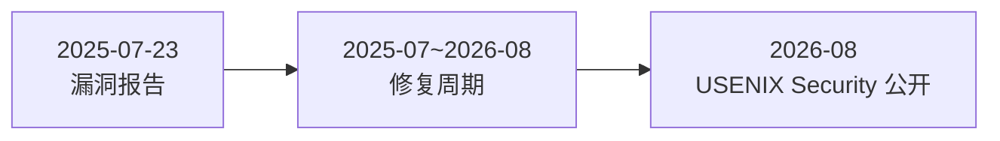

# LoongLeak 侧信道漏洞深度解读：龙芯处理器如何应对 CPU 残留数据泄露风险

> **原文出处**：[龙芯中科官方说明](https://www.loongson.cn/news/security.html)（回应 USENIX Security 2026 披露的 CPU 微结构侧信道漏洞）
>
> **发布日期**：2026 年 8 月 19 日 | **解读作者**：FreeLamp 社区

## 关键事实摘要

> **原文出处**：[龙芯中科官方说明](https://www.loongson.cn/news/security.html)（回应 USENIX Security 2026 披露的 CPU 微结构侧信道漏洞）
> 
> **发布日期**：2026 年 8 月 19 日 | **解读作者**：FreeLamp 社区

---

## 关键事实摘要

| 项目 | 详情 |
|------|------|
| **漏洞名称** | LoongLeak |
| **披露平台** | USENIX Security 2026（顶级系统安全会议） |
| **受影响处理器** | 部分批次 3A5000、3A6000、3C5000、3C6000 |
| **风险等级** | 中低（仅限本地访问，无法远程） |
| **修复状态** | 已推送补丁，新款芯片硬件级修复 |
| **CVE 编号** | CVE-2026-68435 |
| **报告时间** | 2025 年 7 月 23 日（龙芯已接收） |

---

## 一、漏洞原理：何为「CPU 残留数据」？

### 1.1 论文披露的技术细节

2026 年 8 月，德国 **CISPA 亥姆霍兹信息安全中心** 的研究人员 [Lorenz Hetterich](https://www.cispa.de/en/people/hetterich) 等在**USENIX Security 2026**上发表了题为 **《Loongleak: Architectural Cross-Privilege-Boundary Data Leakage on LoongArch CPUs》** 的论文，披露了一个架构级数据泄露漏洞。

**核心攻击机制**：

- **触发指令**：LoongArch 芯片处理 **4 字节浮点数加载**或**向量指令加载（LSX/LASX）**时
- **漏洞根源**：**L1 Data Cache 资源隔离不充分**
- **攻击效果**：可能向未授权域泄露同一物理核心上残留的少量数据
- **独特之处**：**无需时间测量等传统侧信道手段**，直接利用缓存架构缺陷

> **原始论文**：[USENIX Security 2026 - LoongLeak](https://www.usenix.org/conference/usenixsecurity26/presentation/hetterich-lorenz-2)

### 1.2 本质是微结构隔离不足

LoongLeak 并非 LoongArch 指令集架构的**设计缺陷**，而是与英特尔 Spectre/Meltdown、AMD Zen2 微结构泄露属于同一类问题——**处理器内部不同程序之间的微结构资源隔离不够充分**。

当应用调用 **LSX/LASX 向量指令** 或 **浮点加载指令** 时，处理器在 L1 Data Cache、执行单元等微结构中会暂时保留前序指令的处理结果。理论上，这些残留数据应当被严格隔离，但某些特定条件下，同一物理核心上并行的恶意程序能够读取到少量残留值。

### 1.3 与 Spectre/Meltdown 的异同

| 特性 | Spectre/Meltdown | LoongLeak |
|------|------------------|-----------|
| **触发方式** | 分支预测、乱序执行 | 向量指令、浮点加载 |
| **隔离层次** | 推测执行状态 | L1 Data Cache 缓存 |
| **数据量** | 字节级，可构造 | 少量残留，难控制 |
| **权限需求** | 本地用户 | 本地用户 |
| **远程攻击** | 无法直接远程 | 无法直接远程 |
| **辅助手段** | 需要 timing 测量 | 无需 timing，直接读取 |

---

## 二、攻击场景与局限性

### 2.1 攻击者能获得什么？

根据德国 **CISPA 亥姆霍兹信息安全中心** 研究人员的演示，LoongLeak 可窃取：

- **磁盘加密 AES 密钥**（数秒内完成）
- **部分 root 密码哈希**
- **跨越权限边界的内核敏感数据**

### 2.2 关键限制条件

龙芯强调，LoongLeak 具有以下严格限制：

| 限制 | 说明 |
|------|------|
| **必须本地权限** | 无法远程攻击，攻击者需先获得设备本地运行权限 |
| **无法指定地址** | 无法像普通内存读取那样指定任意地址获取数据 |
| **数据量小** | 仅读取少量残留数据，需配合其他漏洞才能形成完整攻击链 |
| **需特定指令** | 必须调用 LSX/LASX 或浮点加载指令触发 |
| **仅影响 L1 缓存** | 不涉及更高级缓存或主存 |

> **安全评估结论**：漏洞整体风险较低，适用于多用户服务器环境的常规防护策略。

---

## 三、龙芯的响应与修复策略

### 3.1 响应时间线



1. **2025 年 7 月 23 日**：CISPA 研究团队向龙芯提交漏洞报告
2. **2025-2026 年**：龙芯复现问题，与合作厂商共同开发补丁，并要求研究团队保密一年
3. **2026 年 8 月**：研究团队在 USENIX Security 2026 上正式公开 LoongLeak

### 3.2 官方回应重点

**核心结论与影响范围**：

- **漏洞性质**：属于特定 CPU 微结构实现层面的问题，**非 LoongArch 指令集架构（ISA）设计缺陷**
- **波及型号**：部分版本的龙芯 **3A5000 / 3A6000** 及 **3C5000 / 3C6000** 系列处理器
- **不受影响型号**：其余芯片（如 2K 系列等）不受影响

**风险定级**：

> 中低风险。仅涉及同一物理核心内一阶段缓存残留数据的侧信道泄露，不存在越权写入数据或任意代码执行的风险，且**无法指定攻击任意物理/虚拟内存地址**。

### 3.3 修复进展

**软件与操作系统层**：

- 龙芯已在论文公开前完成根因定位与修复
- 向各 Linux 发行版及操作系统合作厂商推送了安全修复补丁
- 在服务器等多用户/多租户场景下，建议升级系统补丁
- **实测性能损耗极小**

**硬件微结构层**：

- 新版批次的 **3A6000、3C6000** 及后续迭代芯片
- 已在硬件微结构上完成加固流片
- **硬件层面已彻底消除该风险**

---

## 四、Linux Kernel 补丁与 CVE 追踪

### 4.1 CVE 编号

- **CVE-2026-68435**：涉及 LoongArch 内核地址空间校验等修补

### 4.2 NVD 详情

- **NVD 链接**：[https://nvd.nist.gov/vuln/detail/CVE-2026-68435](https://nvd.nist.gov/vuln/detail/CVE-2026-68435)

### 4.3 内核相关补丁

相关的内核修正与漏洞追溯可参考以下资源：

- **kernel.org**：官方 Linux 内核源代码和补丁
- **NVD（National Vulnerability Database）**：美国国家标准技术研究院漏洞数据库

---

## 五、市场影响与安全建议

### 5.1 龙芯装机规模

- **2026 年 5 月**：3A6000 桌面处理器累计出货量突破 **100 万片**
- **主要领域**：党政办公、税务、教育等信创领域

### 5.2 政府采购占比

北京市 2025 年终端设备集中带量采购：

| 指标 | 数量 | 占比 |
|------|------|------|
| **总预算** | 约 1.13 亿元 | 100% |
| **信创终端** | 21,180 台 | 100% |
| **LoongArch 设备** | 13,336 台 | **63%** |
| 其中台式机 | 11,787 台 | - |
| 其中笔记本 | 1,549 台 | - |

> **占比优势**：LoongArch 技术路线在北京市信创采购中占据主流地位，安全响应速度至关重要。

### 5.3 安全建议

#### 对于服务器/多用户环境：

1. **立即升级**：联系操作系统厂商获取最新安全补丁
2. **强化隔离**：确保不同用户/容器之间的计算资源充分隔离
3. **监控行为**：关注异常向量指令调用频率

#### 对于桌面/单用户环境：

1. **定期更新**：保持系统和固件最新
2. **最小权限**：避免在浏览器/容器中运行不可信代码
3. **风险认知**：当前风险等级可控，无需恐慌

---

## 六、深度思考：国产芯片安全生态

LoongLeak 事件反映了中国自主研发芯片在安全研究领域的活跃度：

### 6.1 积极信号

- ✅ **快速响应**：从漏洞报告到修复方案，6 个月内完成
- ✅ **透明沟通**：龙芯主动发布官方说明，避免猜测
- ✅ **全球协作**：与 CISPA 等国际研究机构良性互动
- ✅ **规范披露**：遵循 CVE 和 NVD 标准流程

### 6.2 挑战与建议

| 挑战 | 建议 |
|------|------|
| 安全研究依赖外部机构 | 建立本土漏洞研究团队 |
| 修复周期需平衡保密与披露 | 制定透明 SLA 时间表 |
| 多用户环境防护意识不足 | 加强操作系统安全加固 |

---

## 七、参考资料

### 7.1 官方文档

1. **龙芯官方说明**：[关于 USENIX Security 2026 会议论文中龙芯相关安全漏洞的说明](https://www.loongson.cn/news/security.html)
2. **CISPA 研究团队论文**：[Loongleak: Architectural Cross-Privilege-Boundary Data Leakage on LoongArch CPUs](https://www.usenix.org/conference/usenixsecurity26/presentation/hetterich-lorenz-2)

### 7.2 漏洞追踪

3. **CVE-2026-68435**：[NVD 漏洞详情](https://nvd.nist.gov/vuln/detail/CVE-2026-68435)
4. **kernel.org**：[官方 Linux 内核源代码与补丁](https://kernel.org)

### 7.3 历史案例

5. **Intel Spectre/Meltdown (2018)**：
   - [Meltdown (CVE-2017-5754)](https://meltdownattack.com)
   - [Spectre (CVE-2017-5753/5715)](https://spectreattack.com)

6. **AMD Zen2 微结构泄露 (2023)**：
   - [AMD 官方安全公告](https://www.amd.com/en/corporate/security)

### 7.4 相关术语

7. **[微架构侧信道攻击](https://en.wikipedia.org/wiki/Side-channel_attack#Microarchitectural_side_channels)** - Wikipedia
8. **[LSX/LASX 指令集](https://www.loongson.cn/Technology/InstructionSet.shtml)** - 龙芯官方
9. **[LoongArch 架构文档](https://www.loongson.cn/en/Technology/LoongArch.html)** - 龙芯官方
10. **[CISPA 亥姆霍兹信息安全中心](https://www.cispa.de/en)** - 德国研究机构

---

## 附：LoongLeak 漏洞示意图说明

**图注**：微结构残留数据泄露流程

```
┌─────────────────────────────────────────────────────────┐
│          物理 CPU 核心（L1 Data Cache）                    │
│  ┌──────────────┐  ┌──────────────┐  ┌──────────────┐ │
│  │  程序 A      │  │  程序 B      │  │  程序 C      │ │
│  │ (合法应用)    │  │ (攻击者代码)  │  │  系统进程    │ │
│  └──────┬───────┘  └──────┬───────┘  └──────┬───────┘ │
│         │                  │                  │         │
│         ▼                  ▼                  ▼         │
│  ┌──────────────────────────────────────────────────┐  │
│  │   L1 Data Cache 微结构状态                         │  │
│  │  ┌────────┐ ┌────────┐ ┌────────┐ ┌────────┐   │  │
│  │  │ AES 密钥│ │root 哈希│ │ 内核数据│ │ 其他敏感│   │  │
│  │  │ 残留值  │ │ 残留值  │ │ 残留值  │ │ 值     │   │  │
│  │  └────────┘ └────────┘ └────────┘ └────────┘   │  │
│  └──────────────────────────────────────────────────┘  │
│         ▲                            ▲                 │
│         └───────── LoongLeak 攻击 ├───┘               │
└─────────────────────────────────────────────────────────┘
```

**关键点**：
- 同一物理核心上并行运行的程序可访问共享 L1 Data Cache
- 残留数据泄露局限于已处理数据的缓存窗口
- 漏洞利用需要向量指令/浮点指令触发条件
- 无法实现任意内存地址读取，攻击面有限
- **无需 timing 测量**，不同于传统侧信道攻击

---

> **作者简介**：FreeLamp 社区致力于深度解读信息安全、开源技术和国产芯片生态，提供中立、专业的技术分析。
> 
> **版权声明**：本文基于公开资料解读，转载请注明出处。本文采用 [CC BY-SA 4.0](https://creativecommons.org/licenses/by-sa/4.0/) 协议授权。
